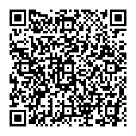

# VietQR Generator

A Node.js console app to generate VietQR codes.

## Usage

To generate a QR code from the command line, use the following command:

```bash
node vietqr.js <bankBin> <accountNumber> <amount> <purpose> <merchantName> <outputFile>
```

### Arguments

-   `bankBin`: The 6-digit bank BIN code.
-   `accountNumber`: The bank account number.
-   `amount`: The transaction amount. Use '0' for a static QR.
-   `purpose`: The transaction purpose/message. Use `""` for empty.
-   `merchantName`: The name of the beneficiary/merchant. Use `""` for empty.
-   `outputFile`: The name of the output PNG file (e.g., 'my-qr.png').

## Programmatic Usage

You can also use this tool programmatically in your own Node.js projects.

First, install the package:

```bash
npm install vietqr-generator
```

Then, you can use the `buildVietQR` and `generateQRImageFile` functions in your code:

```javascript
const { buildVietQR, generateQRImageFile } = require('vietqr-generator');

// Example: Generate a dynamic QR code
const options = {
    bankBin: '970436',
    accountNumber: '1234567890',
    amount: 25000,
    purpose: 'Thanh toan don hang',
    merchantName: 'My Store'
};

// Generate the QR code payload
const payload = buildVietQR(options);
console.log('Generated Payload:', payload);

// Generate the QR code image file
generateQRImageFile(options, 'dynamic-qr.png')
    .then(() => console.log('QR code generated successfully!'))
    .catch(err => console.error('Error generating QR code:', err));
```

## Examples

### Dynamic QR Code

This example generates a QR code with a pre-filled amount of 25,000 VND.

```bash
node vietqr.js 970436 1234567890 25000 "Thanh toan don hang" "My Store" dynamic-qr.png
```

This will create a file named `dynamic-qr.png` with the following QR code:



### Static QR Code

This example generates a QR code without a pre-filled amount.

```bash
node vietqr.js 970415 0987654321 0 "" "Nguyen Van A" static-qr.png
```

This will create a file named `static-qr.png` with a generic QR code that can be used for any amount.